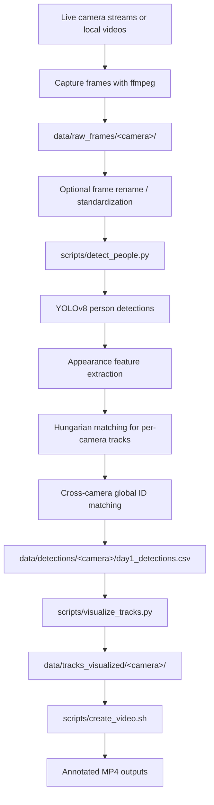

# Facial Recognition / Person Tracking Pipeline

This repository contains a computer-vision pipeline for collecting live-camera
frames, detecting people, assigning per-camera track IDs, matching appearances
across cameras, and rendering annotated output videos.

Despite the repo name, the current implementation tracks whole-person detections
rather than running face embedding recognition. Person detections come from
YOLOv8, and cross-camera matching uses simple HSV appearance histograms from
the upper and lower body regions.

## Pipeline



## What It Produces

The main detection output is one CSV per camera/day:

```text
data/detections/<camera>/day1_detections.csv
```

Each row represents one person detection in one frame and includes:

- `camera`, `day`, `frame_file`, `frame_path`, `timestamp`
- `person_id_in_frame`
- `track_id` for within-camera temporal tracking
- `global_id` for cross-camera appearance matching
- bounding box coordinates: `x1`, `y1`, `x2`, `y2`
- box dimensions and center: `bbox_width`, `bbox_height`, `bbox_area`, `center_x`, `center_y`
- YOLO confidence and matching scores: `confidence`, `match_score`, `global_match_score`

Visualization outputs are written as annotated frames:

```text
data/tracks_visualized/<camera>/
```

The video creation script can then assemble those frames into MP4 files such as
`balcony.mp4`, `bar_stage.mp4`, `inside_bar.mp4`, and `street_view.mp4`.

## Repository Layout

```text
.
|-- data/
|   |-- scripts/
|   |   |-- capture_frames.sh
|   |   |-- capture_frames_balcony_view.sh
|   |   |-- capture_frames_bar_stage.sh
|   |   |-- capture_frames_inside_bar.sh
|   |   |-- capture_frames_street_view.sh
|   |   `-- rename_frames.py
|   |-- raw_frames/
|   |-- detections/
|   `-- tracks_visualized/
|-- scripts/
|   |-- detect_people.py
|   |-- visualize_tracks.py
|   |-- create_video.sh
|   `-- test.py
|-- requirements.txt
|-- yolov8n.pt
`-- *.mp4
```

Generated data directories may not exist until the pipeline is run.

## Requirements

Python dependencies are listed in `requirements.txt`.

Install them with:

```bash
pip install -r requirements.txt
```

System tools used by the capture and video scripts:

- `ffmpeg`
- `yt-dlp` for YouTube-backed live streams

The default detector model is `yolov8n.pt`, which is included in the repo and is
small enough to run on CPU.

## Usage

### 1. Capture Frames

Use the generic capture script when you already have a direct stream URL:

```bash
bash data/scripts/capture_frames.sh \
  balcony \
  day1 \
  00:05:00 \
  0.5 \
  "STREAM_URL"
```

Camera-specific wrappers are also included:

```bash
bash data/scripts/capture_frames_balcony_view.sh
bash data/scripts/capture_frames_bar_stage.sh
bash data/scripts/capture_frames_inside_bar.sh
bash data/scripts/capture_frames_street_view.sh
```

Note: the EarthCam wrapper scripts contain placeholder tokenized stream URLs.
Those URLs may need to be refreshed before capture.

### 2. Rename Frames, If Needed

If frames are still named like `frame_000001.jpg`, standardize them with:

```bash
python3 data/scripts/rename_frames.py "data/raw_frames/<camera>/day1" --dry-run
python3 data/scripts/rename_frames.py "data/raw_frames/<camera>/day1"
```

The detector currently expects filenames shaped like:

```text
<camera>_<time>.jpg
```

Examples:

```text
balcony_18-00-00.jpg
inside_bar_19-38-09.jpg
```

### 3. Run Person Detection and Tracking

```bash
python3 scripts/detect_people.py \
  --raw-frames-dir data/raw_frames \
  --detections-dir data/detections \
  --model yolov8n.pt \
  --conf 0.25
```

The detector:

1. Recursively collects `.jpg`, `.jpeg`, and `.png` frames.
2. Runs YOLOv8 and keeps detections whose class is `person`.
3. Extracts a lightweight color-histogram appearance feature from each person crop.
4. Uses Hungarian assignment to maintain track IDs within each camera.
5. Compares appearance features across cameras to assign global IDs.
6. Writes grouped CSV files under `data/detections/<camera>/`.

### 4. Visualize Tracks

Run visualization for each camera:

```bash
python3 scripts/visualize_tracks.py \
  --csv-path data/detections/balcony/day1_detections.csv \
  --raw-frames-dir data/raw_frames/balcony \
  --out-dir data/tracks_visualized/balcony

python3 scripts/visualize_tracks.py \
  --csv-path data/detections/bar_stage/day1_detections.csv \
  --raw-frames-dir data/raw_frames/bar_stage \
  --out-dir data/tracks_visualized/bar_stage

python3 scripts/visualize_tracks.py \
  --csv-path data/detections/inside_bar/day1_detections.csv \
  --raw-frames-dir data/raw_frames/inside_bar \
  --out-dir data/tracks_visualized/inside_bar

python3 scripts/visualize_tracks.py \
  --csv-path data/detections/street_view/day1_detections.csv \
  --raw-frames-dir data/raw_frames/street_view \
  --out-dir data/tracks_visualized/street_view
```

Bounding boxes are drawn in green for normal detections and red when a detection
has a cross-camera `global_match_score`.

### 5. Build Annotated Videos

```bash
bash scripts/create_video.sh
```

This creates MP4 files from the annotated frame directories.

## Notes and Limitations

- Tracking is heuristic and appearance-based; it is not biometric face recognition.
- Global IDs are assigned from simple color histograms, so similar clothing,
  lighting shifts, and occlusions can cause ID switches.
- `detect_people.py` currently runs YOLO on CPU by default.
- The parser in `detect_people.py` assumes frame names end with a time-like token
  such as `18-00-00`; adjust `parse_filename` if your frame naming format changes.
- The capture scripts are environment-specific and may need path or stream URL
  updates before use on another machine.
